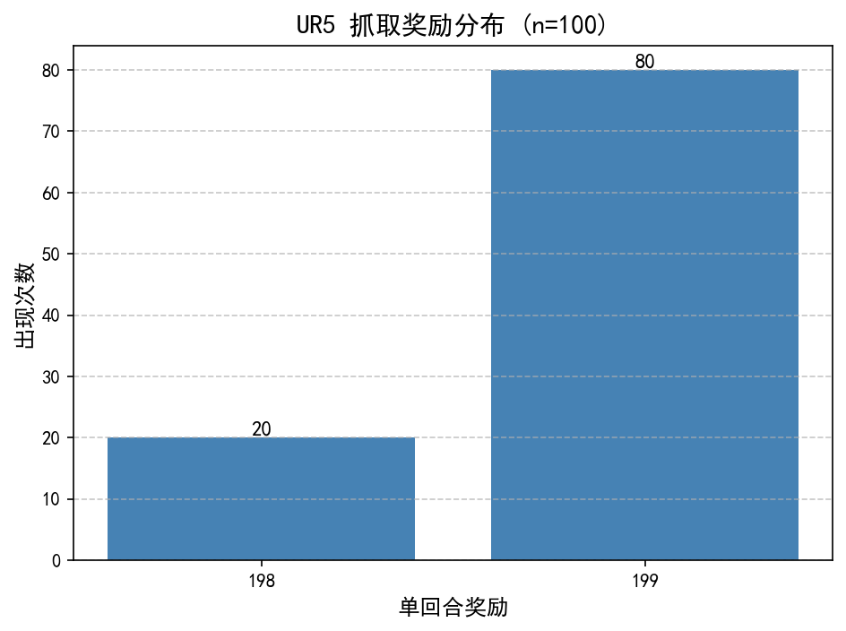

# UR5 仿真抓取：基于 SAC 的端到端强化学习策略

[](https://opensource.org/licenses/MIT)
[](https://www.python.org/downloads/)

## 📖 项目简介

本项目基于 PyBullet 物理引擎，使用 **SAC (Soft Actor-Critic)** 算法训练 UR5 机械臂在仿真环境中执行**随机位置的物体抓取**任务。通过设计密集奖励函数和优化训练速度，模型在 100 次随机测试中达到了 **100% 的成功率**。

> **转行者注**：本项目是我从土木工程转向机器人算法领域的里程碑项目，重点实践了“仿真环境搭建 -> 强化学习训练 -> 模型评估”的完整闭环。

## 🔧 环境配置

- **物理引擎**：PyBullet 3.2.7
- **强化学习框架**：Stable-Baselines3 (SAC)
- **仿真环境接口**：Gymnasium
- **依赖管理**：Conda / pip

```bash
pip install -r requirements.txt -i https://pypi.tuna.tsinghua.edu.cn/simple
```

## 🎯 核心设计

- **观测空间 (Observation)**：物体的二维平面坐标 `(x, y)`
- **动作空间 (Action)**：机械臂末端在二维平面上的位移 `(dx, dy)`
- **奖励函数 (Reward)**：
  - 成功抓取（距离 < 0.01m）：`+100 + 剩余步数奖励`
  - 未抓取：`-10 * 当前距离`（密集惩罚，引导策略靠近目标）

## 🚀 关键优化（性能提升 30 倍）

1. **移除演示动画**：注释掉抓取成功后的 `for _ in range(100): p.stepSimulation()`，避免无效物理计算。
2. **禁用 GUI 渲染**：训练时强制使用 `p.DIRECT` 无头模式，减少 GPU/CPU 绘图开销。
3. **清除打印延迟**：移除 `time.sleep` 语句，防止 I/O 阻塞训练循环。
4. **断点续训**：利用 `CheckpointCallback` 每 1000 步保存模型，支持意外中断后无缝恢复。

## 📊 评估结果

在 100 次随机位置（X: 0.3 ~ 0.7, Y: -0.3 ~ 0.3）的严格测试中：

- **任务成功率**：100%（100/100）
- **决策效率**：
  - **80% 的概率在 1 步内精准抓取**（单回合奖励 199）
  - **20% 的概率在 2 步内精准抓取**（单回合奖励 198）

> 注：单回合最高奖励为 199（基础奖励 100 + 剩余最大步数 99），意味着机械臂仅需一次动作决策即可完成定位与抓取。




## 🏃 如何运行

### 1. 环境配置（首次运行）
```bash
# 创建 Conda 环境（若使用 Conda）
conda create -n grasp_env python=3.10 -y
conda activate grasp_env
# 安装核心依赖（使用清华源加速）
pip install -r requirements.txt -i https://pypi.tuna.tsinghua.edu.cn/simple
```

### 2. 训练模型（可选，已提供预训练权重）
本仓库已包含训练至 14,000 步的检查点（`models/ur_robot_sac_14000_steps.zip`），可直接跳至第 3 步评估。

若需从头训练，请修改 `main_rl.py` 中的 `total_timesteps` 参数（建议起始值 `100000`），并执行：
```bash
python main_rl.py
```
> **注**：由于本项目对训练速度做了极致优化（移除 GUI 渲染与冗余循环），在消费级 CPU（如 Intel i7）上跑完 10 万步约需 20~30 分钟，请合理安排时间。

### 3. 评估模型（获取成功率）
将训练好的模型（或使用仓库自带的 `14000_steps` 模型）放入根目录，运行评估脚本：
```bash
python scripts/final_eval.py
```
预期输出：`📊 正式评估结果 (n=100): 100.0%`

